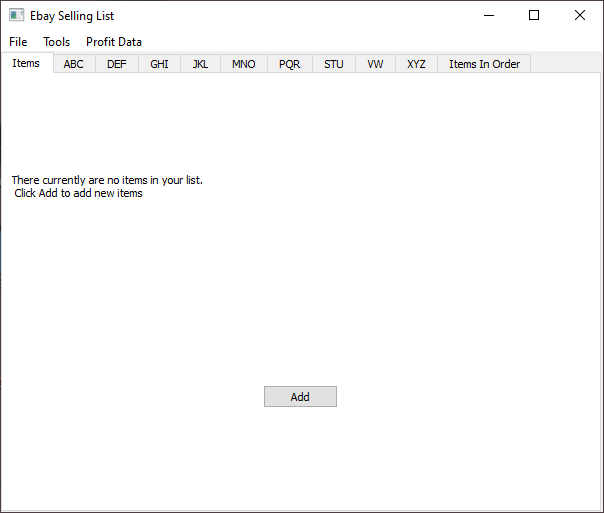

# Ebay Selling List 
A Simple Ebay resellers' app built with QT 5.12.2 and C++ 11.

## Project information
This program is an Ebay selling list, built for people who resell in Ebay. While this initially
started as a simple project to practice QT libraries, I have further developed it into a program useable
by anyone looking to resell in Ebay. This is meant for people who don't want to pay a pretty penny for anything more fancy than what
you could do with a pen and paper (thought with added bells and whistles).

## Getting started
In order to get started, you can either download the src folder and compile the files yourself, or you can download the build folder
and run the exe in there-simple as that. Once the program is up and running, you will find a scren similar to this 

